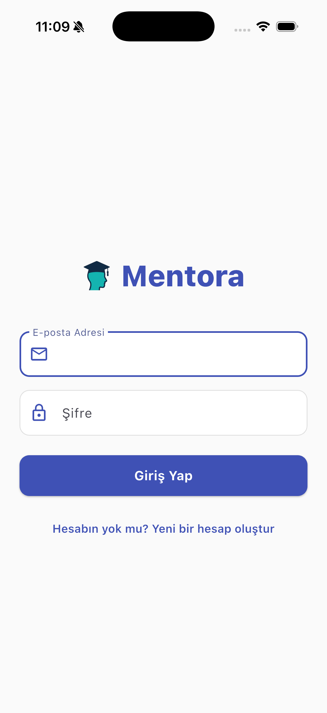
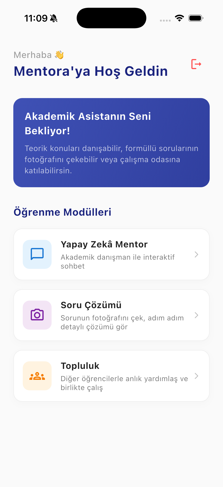
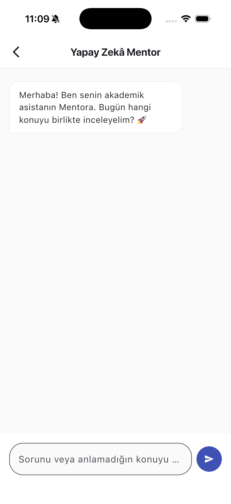
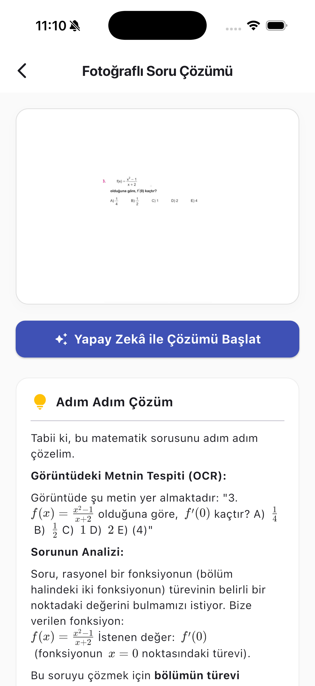
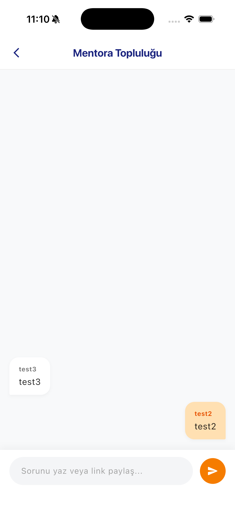
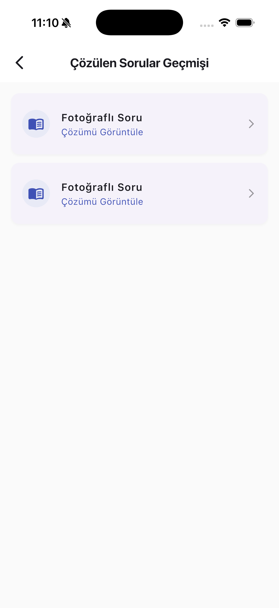

<h1 align="center">
🎓 Mentora
</h1>

Yapay Zekâ Destekli Akademik Öğrenme Platformu

Flutter • FastAPI • Firebase • Gemini • Ollama

## 📖 Proje Hakkında

**Mentora**, üniversite öğrencilerinin akademik öğrenme süreçlerini desteklemek amacıyla geliştirilmiş yapay zekâ destekli mobil bir öğrenme platformudur.

Platform; **Akademik Mentor**, **Fotoğraftan Adım Adım Soru Çözümü** ve **Topluluk (Social Learning)** modüllerini tek bir uygulamada bir araya getirerek öğrencilerin ders çalışma deneyimini daha verimli ve etkileşimli hâle getirmeyi amaçlamaktadır.

Uygulama; Flutter tabanlı mobil istemci, FastAPI ile geliştirilen backend servisi, Firebase bulut altyapısı ve Büyük Dil Modelleri (LLM) kullanılarak geliştirilmiştir. Sistem, yerel çalışan açık kaynak modelleri (Ollama) ile bulut tabanlı yapay zekâ servislerini (Google Gemini API) birlikte kullanabilen hibrit bir mimariye sahiptir.

Bu proje, üniversite stajım kapsamında **uçtan uca tarafımca tasarlanmış ve geliştirilmiştir.** Geliştirme sürecinde sistem mimarisi, mobil uygulama, backend servisleri, yapay zekâ entegrasyonları, veritabanı tasarımı ve performans optimizasyonu gibi yazılım geliştirme süreçleri tek geliştirici olarak yürütülmüştür.

---

# ✨ Temel Özellikler

## 🎓 Yapay Zekâ Akademik Mentor

Yapay zekâ destekli akademik danışman modülü sayesinde kullanıcılar; ders konuları, yazılım geliştirme, matematik ve mühendislik gibi alanlarda doğal dil kullanarak sorular sorabilir. Akademik Mentor, yalnızca cevap üretmek yerine öğrenciyi yönlendiren, açıklayan ve öğrenme sürecini destekleyen bir yaklaşım benimser.

---

## 📷 Fotoğraftan Soru Çözümü

Kullanıcılar çözemedikleri soruların fotoğraflarını uygulamaya yükleyebilir. Yapay zekâ; görseli analiz ederek matematiksel ifadeleri algılar, çözüm sürecini oluşturur ve sonucu Markdown ile LaTeX formatında adım adım sunar.

---

## 👥 Topluluk (Community)

Topluluk modülü sayesinde öğrenciler soru paylaşabilir, diğer kullanıcıların paylaşımlarını inceleyebilir, etkileşimde bulunabilir ve bilgi alışverişi yapabilir. Böylece bireysel öğrenmenin yanında sosyal öğrenme deneyimi de desteklenir.

---

## 📚 Çözüm Geçmişi

Yapay zekâ ile gerçekleştirilen soru çözümleri ve akademik mentor görüşmeleri kullanıcı hesabı ile ilişkilendirilerek saklanır. Kullanıcılar daha önce oluşturdukları içeriklere istedikleri zaman tekrar erişebilir.

---

## 🔐 Güvenli Kullanıcı Yönetimi

Firebase Authentication altyapısı kullanılarak kullanıcı kayıt, giriş ve oturum yönetimi güvenli bir şekilde gerçekleştirilmiştir.

---

# 📱 Uygulama Ekran Görüntüleri

| Giriş | Ana Sayfa |
|-------|-----------|
|  |  |

| Akademik Mentor | Fotoğraftan Soru Çözümü |
|-----------------|-------------------------|
|  |  |

| Topluluk | Geçmiş |
|----------|---------|
|  |  |
